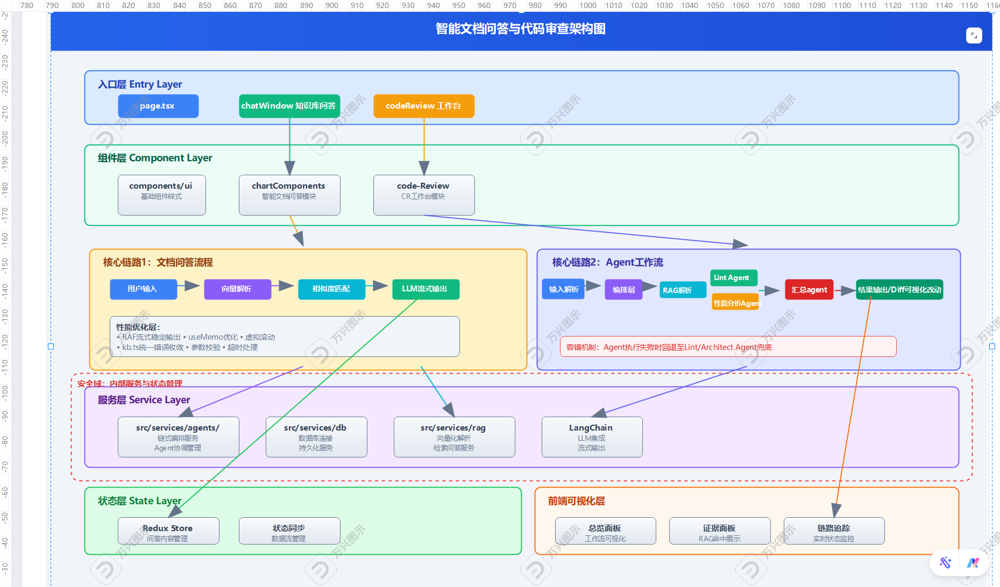
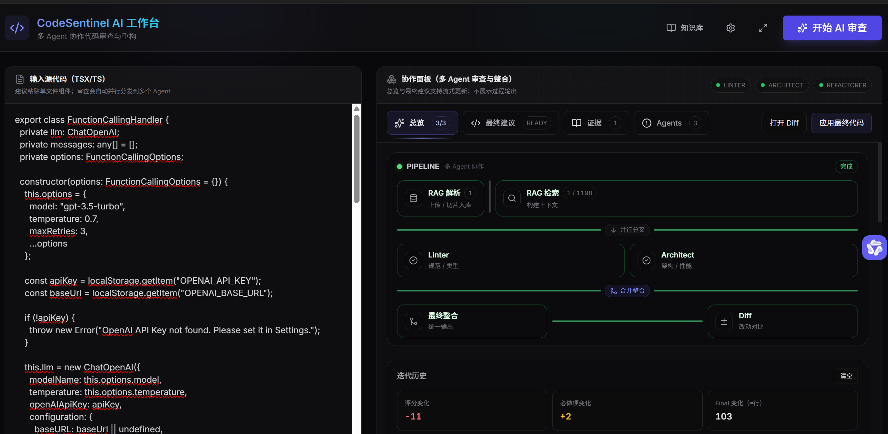
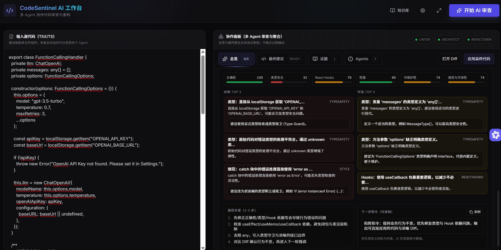
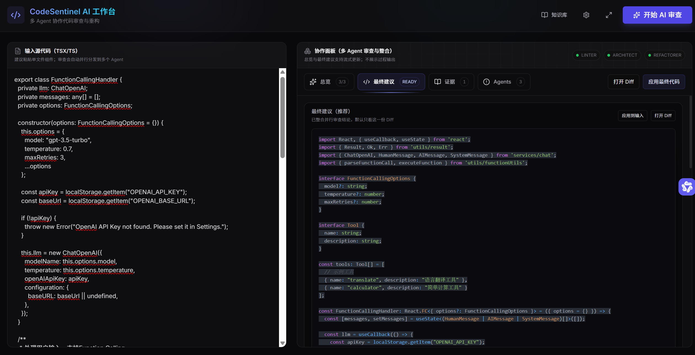
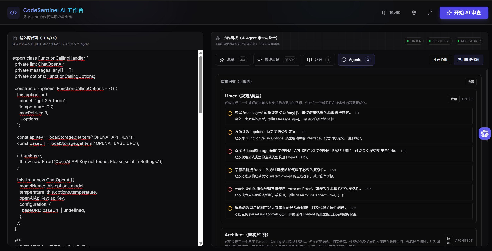
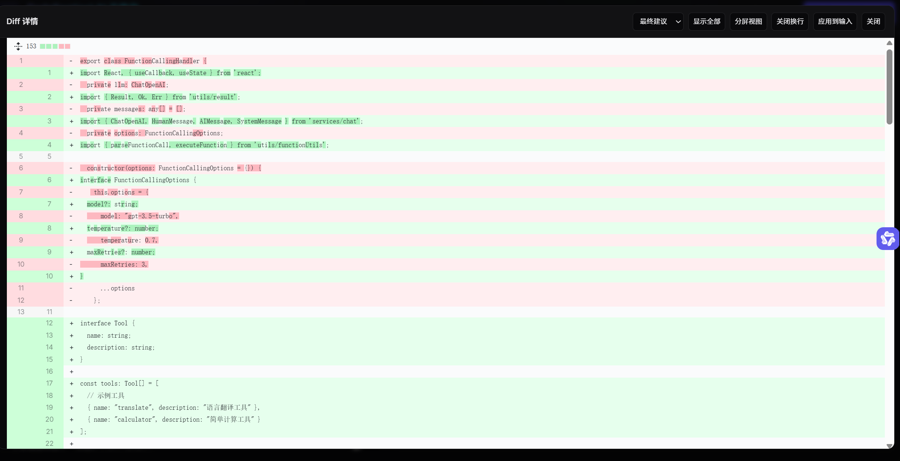

# （多步骤 Agent 代码审查与重构工作台/智能问答）AI 驱动开发

一个面向前端工程师的 AI Code Review 工作台：把“RAG 检索证据 + 多 Agent 并行审查 + 最终可应用重构 + Diff 校验”串成一条可视化、可追溯、可流式反馈的流水线。
## 架构图（图示）
  

## 图例展示
1. 总览 多agent 执行流可视化
2. 最终修改建议,综合规范,架构性能agent 并支持多次迭代
3. 具体每个agent发现问题细节可追溯
4. 支持代码diff详情,确保准确度
   
   
   
   
   
### RAG检索
通过 LLM 向量化, 策略为通过 文档段落做分割避免语义散乱

### 目录表:

入口文件 :: page.tsx --入口文件-->  chatwindow(知识库问答,支持持久化)- --> codeReview(工作台)--knowloage 向量解析和检索内容


### 模块层

components:/feature/ui 最基础组件样式    /features/chartComponents(智能文档问答模块)   /features/code-Review/cr工作台模块实现和拆分


### 服务层

: src/services/agents/ 涉及总和各个agent的链式编排--    src/services/db  数据库链接 /rag 涉及,对文件向量化解析/以及根据输入问答进行检索回答


### 状态层

:对redux 进行问答内容, 进行redux 数据化,设计
## 技术选型

- Next.js 14 + React 18 + TypeScript
- UI：Tailwind CSS + lucide-react
- LLM/RAG：LangChain(OpenAI) + 本地知识库检索（用于 reviewContext 注入）
- 编排：（并行审查 + 最终整合）
- 流式：Refactorer JSON 流式输出 + 前端从未完 JSON 中提取 suggestedCode 片段
- 向量数据库：pgvector 面向中小企业向量数据库 

## 架构设计

目标：把不确定的 LLM 过程变成可控的数据流与可复盘的产物。

- 分层
  - Components：工作台 UI（工作流、总览、最终建议、Diff）
  - Services：Agent 编排、RAG 检索、聚合器（把多结果变成可行动总览）
  - Utils：Result<T,E>、解析/校验/工具函数
- Agent 协作
  - 并行审查：Linter + Architect 并行启动，降低等待
  - 最终整合：Refactorer 在“指挥指令 + 审查线索”下输出最终代码
- 结果协议（JSON）
  - 每个 Agent 输出结构化 JSON（comments / thinking / suggestedCode）
  - Refactorer 强制优先输出 suggestedCode，便于前端流式展示“最终代码草稿”

## 关键数据流

1. 输入代码 + 指挥指令 → 构建 RAG 上下文（命中片段）-》多agent 工作流--输出汇总
2. Orchestrator 并行调用 Linter/Architect → 收到结果后聚合总览并更新 UI
3. 汇总线索后调用 Refactorer → 流式输出 suggestedCode → 完成后产出 finalCode
4. 用户打开 Diff / 一键应用 / 保存快照复盘

流式与状态
- 状态流：UI 通过 `agentStatus` 记录各 Agent 的 thinking/done/error，用于工作流可视化
- 总览流：每个 Agent 结果返回时触发一次聚合，先生成 `draftAggregated`，最终完成后生成 `aggregated`
- 代码流：仅对 Refactorer 做 token 流式处理，从未完 JSON 中提取 suggestedCode 片段用于预览

## 目录结构（节选）

``` bash
Ai-Tolls/
├─ src/
│  ├─ app/
│  │  ├─ code-review/page.tsx          # CR 入口：挂载工作台
│  │  └─ api/
│  │     └─ kb/
│  │        ├─ ingest/route.ts         # 入库：chunk+embedding→写入 DB
│  │        ├─ retrieve/route.ts       # 检索：query→embedding→返回 ctx/evidence
│  │        └─ export/route.ts         # 导出：hydrate 用
│  │
│  ├─ components/
│  │  └─ features/
│  │     ├─ code-review/CodeReview.tsx              # CR 工作台 UI 框架
│  │     └─ review/context/useReviewCore.ts         # 核心流程：handleReview 串 RAG+Agents
│  │
│  ├─ services/
│  │  ├─ Agents/
│  │  │  ├─ Orchestrator.ts            # 编排：RAG → 并行审查 → Refactorer 汇总
│  │  │  ├─ RAGAgent.ts                # RAG 步骤：kbCount / retrieve ctxText
│  │  │  └─ types.ts                   # AgentTask/AgentResult 协议
│  │  ├─ api/kb.ts                     # 前端调用 /api/kb/*（timeout + Result）
│  │  ├─ db/kbDb.ts                    # KB 持久化（documents/chunks/embedding）
│  │  ├─ rag/ingest.ts                 # 向量化：切片+embedding（含 fallback）
│  │  └─ rag/ragEvidence.ts            # ctxText 构造 / 证据解析
│  │
│  └─ lib/result.ts                    # Result<T,E> 统一错误与异步
│
└─ docker-compose.yml                  # PG（pgvector 镜像）
```

入口页面：

- / 对话平台
- /code-review：代码审查工作台
