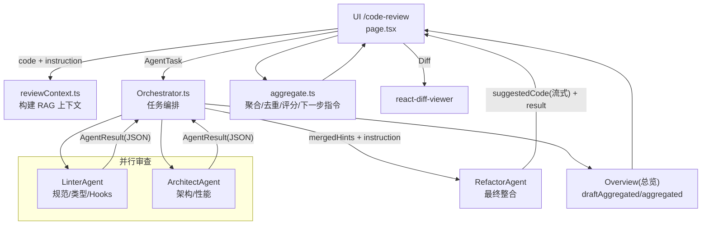

# （多 Agent 代码审查与重构工作台）AI 驱动开发

一个面向前端工程师的 AI Code Review 工作台：把“RAG 检索证据 + 多 Agent 并行审查 + 最终可应用重构 + Diff 校验”串成一条可视化、可追溯、可流式反馈的流水线。

## 图例展示

1. 总览 多agent 执行流可视化
2. 最终修改建议,综合规范,架构性能agent 并支持多次迭代
3. 具体每个agent发现问题细节可追溯
4. 支持代码diff详情,确保准确度
   
   
   
   
   

## 架构图（图示）



### RAG检索

通过 LLM 向量化, 策略为通过 文档段落做分割避免语义散乱

## 核心能力

- 多 Agent 并行审查：Linter（规范/类型/Hooks）+ Architect（架构/性能）
- 配置 rules ,skills 保障整体代码可靠性
- 指挥指令：用户给目标与约束，作为最高优先级输入参与下一轮整合
- 总览（指挥视角）：Top 问题、维度评分、推荐步骤、下一步指令（可增量更新）
- 最终建议代码：Refactorer 生成“可直接应用”的完整代码，支持流式预览
- Diff 落地：对比改动并一键应用回编辑器
- 证据链：RAG 命中片段作为可追溯依据（减少“凭空建议”）

## 技术选型

- Next.js 14 + React 18 + TypeScript
- UI：Tailwind CSS + lucide-react
- LLM/RAG：LangChain(OpenAI) + 本地知识库检索（用于 reviewContext 注入）
- 编排：（并行审查 + 最终整合）
- 流式：Refactorer JSON 流式输出 + 前端从未完 JSON 中提取 suggestedCode 片段

## 架构设计

目标：把不确定的 LLM 过程变成可控的数据流与可复盘的产物。

- 分层
  - Components：工作台 UI（工作流、总览、最终建议、Diff）
  - Services：Agent 编排、RAG 检索、聚合器（把多结果变成可行动总览）
  - Utils：Result<T,E>、解析/校验/工具函数
- Agent 协作
  - 并行审查：Linter + Architect 并行启动，降低等待
  - 最终整合：Refactorer 在“指挥指令 + 审查线索”下输出最终代码
- 结果协议（JSON）
  - 每个 Agent 输出结构化 JSON（comments / thinking / suggestedCode）
  - Refactorer 强制优先输出 suggestedCode，便于前端流式展示“最终代码草稿”

## 关键数据流（从点击到可用）

1. 输入代码 + 指挥指令 → 构建 RAG 上下文（命中片段）
2. Orchestrator 并行调用 Linter/Architect → 收到结果后聚合总览并更新 UI
3. 汇总线索后调用 Refactorer → 流式输出 suggestedCode → 完成后产出 finalCode
4. 用户打开 Diff / 一键应用 / 保存快照复盘

流式与状态（你现在的设计点）：

- 状态流：UI 通过 `agentStatus` 记录各 Agent 的 thinking/done/error，用于工作流可视化
- 总览流：每个 Agent 结果返回时触发一次聚合，先生成 `draftAggregated`，最终完成后生成 `aggregated`
- 代码流：仅对 Refactorer 做 token 流式处理，从未完 JSON 中提取 suggestedCode 片段用于预览

## 目录结构（节选）

```bash
src/
├─ app/
│  ├─ code-review/page.tsx        # 工作台 UI（总览/最终建议/证据/Agents）
├─ components/features/
│  ├─ WorkflowStrip.tsx           # 工作流状态条（串行 + 并行）
│  ├─ SummaryCard.tsx             # 总览卡（指挥指令、评分、Top 问题）
│  └─ ReviewHistoryPanel.tsx      # 历史快照（复盘/对比）
├─ services/
│  ├─ agents/                     # 多 Agent + 编排器
│  ├─ review/aggregate.ts         # 聚合器（去重、排序、评分、下一步指令）
│  └─ rag/reviewContext.ts        # 面向 code-review 的检索上下文构建
```

入口页面：

- / 对话平台
- /code-review：代码审查工作台
- /ingest：知识库导入（可选）
